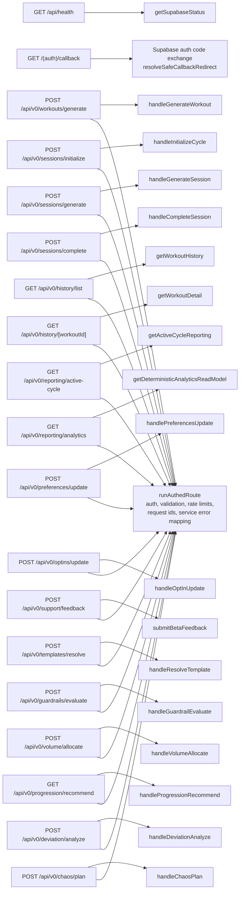
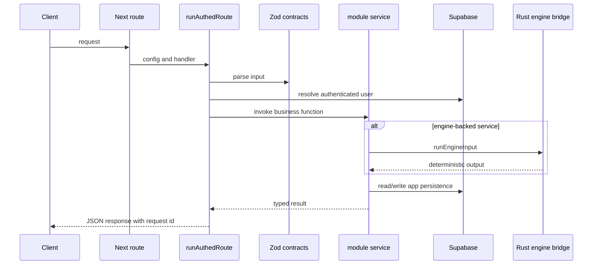

# API Route Service Map

```mermaid
flowchart LR
  RouteHandler["runAuthedRoute<br/>auth, validation, rate limits,<br/>request ids, service error mapping"]

  Health["GET /api/health"] --> HealthImpl["getSupabaseStatus"]
  Callback["GET /(auth)/callback"] --> AuthCallback["Supabase auth code exchange<br/>resolveSafeCallbackRedirect"]

  WorkoutGenerate["POST /api/v0/workouts/generate"] --> HandleGenerateWorkout["handleGenerateWorkout"]
  SessionsInitialize["POST /api/v0/sessions/initialize"] --> HandleInitializeCycle["handleInitializeCycle"]
  SessionsGenerate["POST /api/v0/sessions/generate"] --> HandleGenerateSession["handleGenerateSession"]
  SessionsComplete["POST /api/v0/sessions/complete"] --> HandleCompleteSession["handleCompleteSession"]
  HistoryList["GET /api/v0/history/list"] --> GetWorkoutHistory["getWorkoutHistory"]
  HistoryDetail["GET /api/v0/history/[workoutId]"] --> GetWorkoutDetail["getWorkoutDetail"]
  ReportingActive["GET /api/v0/reporting/active-cycle"] --> GetActiveCycleReporting["getActiveCycleReporting"]
  ReportingAnalytics["GET /api/v0/reporting/analytics"] --> GetDeterministicAnalytics["getDeterministicAnalyticsReadModel"]
  PreferencesUpdate["POST /api/v0/preferences/update"] --> HandlePreferencesUpdate["handlePreferencesUpdate"]
  OptinsUpdate["POST /api/v0/optins/update"] --> HandleOptInUpdate["handleOptInUpdate"]
  SupportFeedback["POST /api/v0/support/feedback"] --> SubmitBetaFeedback["submitBetaFeedback"]
  TemplatesResolve["POST /api/v0/templates/resolve"] --> HandleResolveTemplate["handleResolveTemplate"]
  GuardrailsEvaluate["POST /api/v0/guardrails/evaluate"] --> HandleGuardrailEvaluate["handleGuardrailEvaluate"]
  VolumeAllocate["POST /api/v0/volume/allocate"] --> HandleVolumeAllocate["handleVolumeAllocate"]
  ProgressionRecommend["GET /api/v0/progression/recommend"] --> HandleProgressionRecommend["handleProgressionRecommend"]
  DeviationAnalyze["POST /api/v0/deviation/analyze"] --> HandleDeviationAnalyze["handleDeviationAnalyze"]
  ChaosPlan["POST /api/v0/chaos/plan"] --> HandleChaosPlan["handleChaosPlan"]

  WorkoutGenerate --> RouteHandler
  SessionsInitialize --> RouteHandler
  SessionsGenerate --> RouteHandler
  SessionsComplete --> RouteHandler
  HistoryList --> RouteHandler
  HistoryDetail --> RouteHandler
  ReportingActive --> RouteHandler
  ReportingAnalytics --> RouteHandler
  PreferencesUpdate --> RouteHandler
  OptinsUpdate --> RouteHandler
  SupportFeedback --> RouteHandler
  TemplatesResolve --> RouteHandler
  GuardrailsEvaluate --> RouteHandler
  VolumeAllocate --> RouteHandler
  ProgressionRecommend --> RouteHandler
  DeviationAnalyze --> RouteHandler
  ChaosPlan --> RouteHandler
```

```mermaid
sequenceDiagram
  participant Client
  participant Route as Next route
  participant Wrapper as runAuthedRoute
  participant Contracts as Zod contracts
  participant Service as module service
  participant Supabase
  participant Engine as Rust engine bridge

  Client->>Route: request
  Route->>Wrapper: config and handler
  Wrapper->>Contracts: parse input
  Wrapper->>Supabase: resolve authenticated user
  Wrapper->>Service: invoke business function
  alt engine-backed service
    Service->>Engine: runEngineInput
    Engine-->>Service: deterministic output
  end
  Service->>Supabase: read/write app persistence
  Service-->>Wrapper: typed result
  Wrapper-->>Client: JSON response with request id
```
