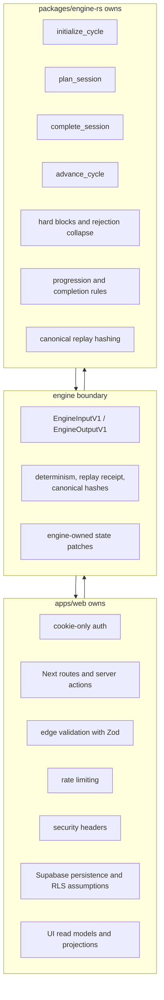
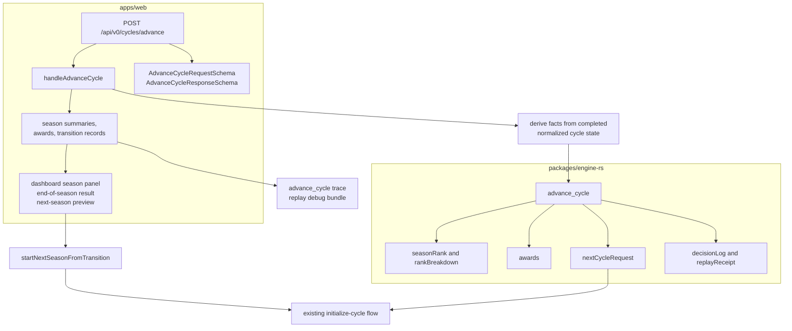

# App Service Map

```mermaid
flowchart LR
  Browser["Browser UI"]
  Middleware["middleware.ts<br/>cookie auth, route guard,<br/>security headers"]
  Pages["Next app pages<br/>auth, title, dashboard,<br/>programs, workout, history,<br/>settings, onboarding"]
  ServerActions["Server actions<br/>auth, onboarding, programs,<br/>cycles"]
  Api["API route handlers<br/>/api/health and /api/v0/*"]
  RouteHandler["runAuthedRoute<br/>parseJsonWithSchema<br/>parseWithSchema"]
  SupabaseClients["Supabase clients<br/>browser, server component,<br/>server action, middleware, admin"]
  Db["Supabase Postgres<br/>RLS-backed app persistence"]
  EngineRunner["runEngineInput<br/>Rust runner bridge"]
  EngineRs["packages/engine-rs<br/>initialize_cycle<br/>plan_session<br/>complete_session<br/>advance_cycle"]
  Contracts["packages/contracts<br/>Zod request/response schemas"]

  Browser --> Middleware
  Middleware --> Pages
  Browser --> Api
  Pages --> ServerActions
  ServerActions --> SupabaseClients
  Api --> RouteHandler
  RouteHandler --> Contracts
  RouteHandler --> SupabaseClients
  SupabaseClients --> Db
  Api --> Services
  ServerActions --> Services
  Services --> SupabaseClients
  Services --> EngineRunner
  EngineRunner --> EngineRs
  Services --> Contracts

  subgraph Services["apps/web/src/modules services"]
    Auth["auth<br/>sign in, sign up, sign out,<br/>logout cookie cleanup"]
    Onboarding["onboarding<br/>completeOnboarding"]
    Programs["programs<br/>catalog, active cycle view,<br/>active program updates"]
    Cycles["cycles<br/>handleInitializeCycle<br/>handleAdvanceCycle<br/>startNextSeasonFromTransition"]
    Sessions["sessions<br/>handleGenerateSession<br/>handleCompleteSession<br/>getRecentWorkoutHistory"]
    Reporting["reporting<br/>active cycle, analytics,<br/>replay explanations"]
    History["history<br/>list and detail reads"]
    Settings["settings<br/>preferences update"]
    Optins["optins<br/>feature/recovery opt-ins"]
    Support["support<br/>beta feedback"]
    Templates["templates<br/>resolve template"]
    Workouts["workouts<br/>legacy generated workout"]
    Guardrails["guardrails<br/>evaluate warning/action"]
    Volume["volume<br/>allocate volume"]
    Progression["progression<br/>recommend strategy"]
    Deviation["deviation<br/>analyze plan drift"]
    Chaos["chaos<br/>deterministic chaos plan"]
    Dashboard["dashboard<br/>summary read models"]
  end
```

```mermaid
flowchart TB
  subgraph ProductShell["apps/web owns"]
    AuthCookies["cookie-only auth"]
    Transport["Next routes and server actions"]
    Validation["edge validation with Zod"]
    RateLimit["rate limiting"]
    SecurityHeaders["security headers"]
    Persistence["Supabase persistence and RLS assumptions"]
    ReadModels["UI read models and projections"]
  end

  subgraph EngineBoundary["engine boundary"]
    EngineEnvelope["EngineInputV1 / EngineOutputV1"]
    Determinism["determinism, replay receipt,<br/>canonical hashes"]
    StatePatch["engine-owned state patches"]
  end

  subgraph RustEngine["packages/engine-rs owns"]
    Initialize["initialize_cycle"]
    Plan["plan_session"]
    Complete["complete_session"]
    Advance["advance_cycle"]
    Constraints["hard blocks and rejection collapse"]
    ProgressionRules["progression and completion rules"]
    Replay["canonical replay hashing"]
  end

  ProductShell --> EngineBoundary
  EngineBoundary --> RustEngine
  RustEngine --> EngineBoundary
  EngineBoundary --> ProductShell
```

## Season Loop App Shell

This diagram shows the current Wave 9 app shell path.

```mermaid
flowchart TB
  subgraph ProductShell["apps/web"]
    AdvanceRoute["POST /api/v0/cycles/advance"]
    AdvanceService["handleAdvanceCycle"]
    AdvanceContracts["AdvanceCycleRequestSchema<br/>AdvanceCycleResponseSchema"]
    SeasonPersistence["season summaries,<br/>awards, transition records"]
    SeasonUI["dashboard season panel<br/>end-of-season result<br/>next-season preview"]
  end

  subgraph Engine30["packages/engine-rs"]
    AdvanceCycle["advance_cycle"]
    Rank["seasonRank and rankBreakdown"]
    Awards["awards"]
    NextCycle["nextCycleRequest"]
    Replay["decisionLog and replayReceipt"]
  end

  AdvanceRoute --> AdvanceContracts
  AdvanceRoute --> AdvanceService
  AdvanceService --> DeriveFacts["derive facts from completed<br/>normalized cycle state"]
  DeriveFacts --> AdvanceCycle
  AdvanceCycle --> Rank
  AdvanceCycle --> Awards
  AdvanceCycle --> NextCycle
  AdvanceCycle --> Replay
  AdvanceService --> SeasonPersistence
  SeasonPersistence --> ReplayTrace["advance_cycle trace<br/>replay debug bundle"]
  SeasonPersistence --> SeasonUI
  SeasonUI --> StartNext["startNextSeasonFromTransition"]
  StartNext --> ExistingInitialize
  NextCycle --> ExistingInitialize["existing initialize-cycle flow"]
```
