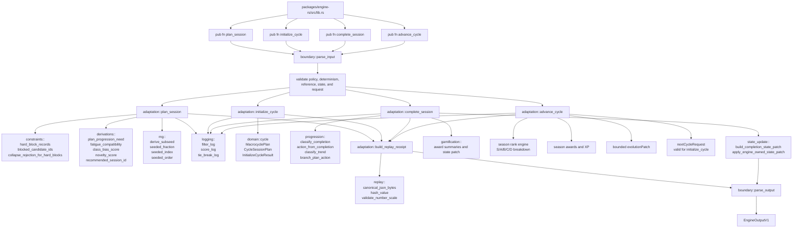
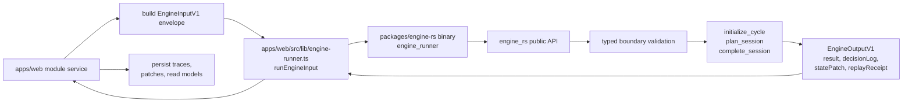
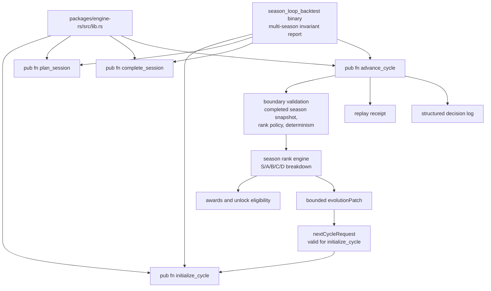

# Engine Function Map

```mermaid
flowchart TB
  Public["packages/engine-rs/src/lib.rs"]
  Public --> PublicPlan["pub fn plan_session"]
  Public --> PublicInitialize["pub fn initialize_cycle"]
  Public --> PublicComplete["pub fn complete_session"]
  Public --> PublicAdvance["pub fn advance_cycle"]

  PublicPlan --> ParseInput["boundary::parse_input"]
  PublicInitialize --> ParseInput
  PublicComplete --> ParseInput
  PublicAdvance --> ParseInput
  ParseInput --> ValidateBoundary["validate policy, determinism,<br/>reference, state, and request"]

  ValidateBoundary --> AdaptPlan["adaptation::plan_session"]
  ValidateBoundary --> AdaptInitialize["adaptation::initialize_cycle"]
  ValidateBoundary --> AdaptComplete["adaptation::complete_session"]
  ValidateBoundary --> AdaptAdvance["adaptation::advance_cycle"]

  AdaptPlan --> Constraints["constraints::<br/>hard_block_records<br/>blocked_candidate_ids<br/>collapse_rejection_for_hard_blocks"]
  AdaptPlan --> Derivations["derivations::<br/>plan_progression_need<br/>fatigue_compatibility<br/>class_bias_score<br/>novelty_score<br/>recommended_session_id"]
  AdaptPlan --> Rng["rng::<br/>derive_subseed<br/>seeded_fraction<br/>seeded_index<br/>seeded_order"]
  AdaptPlan --> Logging["logging::<br/>filter_log<br/>score_log<br/>tie_break_log"]

  AdaptInitialize --> CycleDomain["domain::cycle<br/>MacrocyclePlan<br/>CycleSessionPlan<br/>InitializeCycleResult"]
  AdaptInitialize --> Logging

  AdaptComplete --> Progression["progression::<br/>classify_completion<br/>action_from_completion<br/>classify_trend<br/>branch_plan_action"]
  AdaptComplete --> StateUpdate["state_update::<br/>build_completion_state_patch<br/>apply_engine_owned_state_patch"]
  AdaptComplete --> Gamification["gamification::<br/>award summaries and state patch"]
  AdaptComplete --> Logging

  AdaptAdvance --> SeasonRank["season rank engine<br/>S/A/B/C/D breakdown"]
  AdaptAdvance --> Awards["season awards and XP"]
  AdaptAdvance --> Evolution["bounded evolutionPatch"]
  AdaptAdvance --> NextCycle["nextCycleRequest<br/>valid for initialize_cycle"]
  AdaptAdvance --> Logging

  AdaptPlan --> ReplayReceipt["adaptation::build_replay_receipt"]
  AdaptInitialize --> ReplayReceipt
  AdaptComplete --> ReplayReceipt
  AdaptAdvance --> ReplayReceipt
  ReplayReceipt --> Replay["replay::<br/>canonical_json_bytes<br/>hash_value<br/>validate_number_scale"]
  ReplayReceipt --> ParseOutput["boundary::parse_output"]
  StateUpdate --> ParseOutput
  ParseOutput --> PublicOutput["EngineOutputV1"]
```

```mermaid
flowchart LR
  WebService["apps/web module service"]
  BuildInput["build EngineInputV1 envelope"]
  Runner["apps/web/src/lib/engine-runner.ts<br/>runEngineInput"]
  Binary["packages/engine-rs binary<br/>engine_runner"]
  EngineApi["engine_rs public API"]
  TypedBoundary["typed boundary validation"]
  Operation["initialize_cycle<br/>plan_session<br/>complete_session"]
  Output["EngineOutputV1<br/>result, decisionLog,<br/>statePatch, replayReceipt"]
  Persist["persist traces,<br/>patches, read models"]

  WebService --> BuildInput
  BuildInput --> Runner
  Runner --> Binary
  Binary --> EngineApi
  EngineApi --> TypedBoundary
  TypedBoundary --> Operation
  Operation --> Output
  Output --> Runner
  Runner --> WebService
  WebService --> Persist
```

## Engine 30 Season Advancement Surface

This diagram shows the current headless season advancement path.

```mermaid
flowchart TB
  Public["packages/engine-rs/src/lib.rs"]
  Public --> PublicInitialize["pub fn initialize_cycle"]
  Public --> PublicPlan["pub fn plan_session"]
  Public --> PublicComplete["pub fn complete_session"]
  Public --> PublicAdvance["pub fn advance_cycle"]

  PublicAdvance --> AdvanceBoundary["boundary validation<br/>completed season snapshot,<br/>rank policy, determinism"]
  AdvanceBoundary --> SeasonRank["season rank engine<br/>S/A/B/C/D breakdown"]
  SeasonRank --> Awards["awards and unlock eligibility"]
  SeasonRank --> Evolution["bounded evolutionPatch"]
  Evolution --> NextCycle["nextCycleRequest<br/>valid for initialize_cycle"]
  PublicAdvance --> ReplayReceipt["replay receipt"]
  PublicAdvance --> DecisionLog["structured decision log"]

  Harness["season_loop_backtest binary<br/>multi-season invariant report"] --> PublicInitialize
  Harness --> PublicPlan
  Harness --> PublicComplete
  Harness --> PublicAdvance
  NextCycle --> PublicInitialize
```
