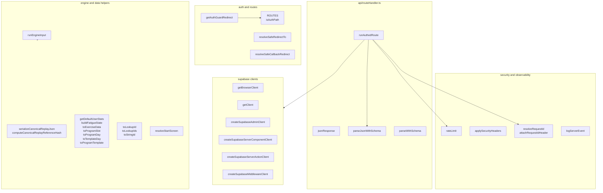
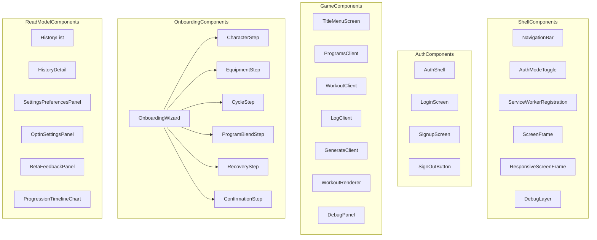
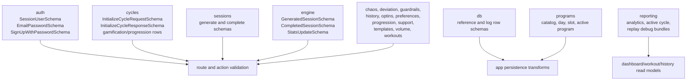
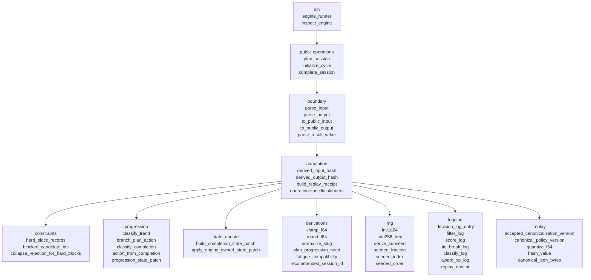

# Function Inventory

This inventory is grouped around runtime entry points and service surfaces. It includes exported functions and the internal helpers that currently define the main app and engine behavior.

## App API Routes

```mermaid
flowchart TB
  Health["GET /api/health<br/>getSupabaseStatus"]
  AuthCallback["GET /(auth)/callback<br/>Supabase code exchange"]
  Workouts["POST /api/v0/workouts/generate<br/>handleGenerateWorkout"]
  Initialize["POST /api/v0/sessions/initialize<br/>handleInitializeCycle"]
  Generate["POST /api/v0/sessions/generate<br/>handleGenerateSession"]
  Complete["POST /api/v0/sessions/complete<br/>handleCompleteSession"]
  HistoryList["GET /api/v0/history/list<br/>getWorkoutHistory"]
  HistoryDetail["GET /api/v0/history/[workoutId]<br/>getWorkoutDetail"]
  ActiveCycle["GET /api/v0/reporting/active-cycle<br/>getActiveCycleReporting"]
  Analytics["GET /api/v0/reporting/analytics<br/>getDeterministicAnalyticsReadModel"]
  Preferences["POST /api/v0/preferences/update<br/>handlePreferencesUpdate"]
  Optins["POST /api/v0/optins/update<br/>handleOptInUpdate"]
  Support["POST /api/v0/support/feedback<br/>submitBetaFeedback"]
  Templates["POST /api/v0/templates/resolve<br/>handleResolveTemplate"]
  Guardrails["POST /api/v0/guardrails/evaluate<br/>handleGuardrailEvaluate"]
  Volume["POST /api/v0/volume/allocate<br/>handleVolumeAllocate"]
  Progression["GET /api/v0/progression/recommend<br/>handleProgressionRecommend"]
  Deviation["POST /api/v0/deviation/analyze<br/>handleDeviationAnalyze"]
  Chaos["POST /api/v0/chaos/plan<br/>handleChaosPlan"]
```

## Module Services And Actions

```mermaid
flowchart TB
  subgraph Auth
    SignIn["signInAction"]
    SignUp["signUpAction"]
    SignOut["signOutAction"]
    Logout["logoutUserSession"]
    ToAuthed["toAuthedUser"]
  end

  subgraph Onboarding
    CompleteOnboarding["completeOnboarding"]
    NormalizeOnboarding["normalizeList<br/>fatiguePreferenceToLevel<br/>normalizeProgramWeights"]
  end

  subgraph Programs
    AvailablePrograms["getAvailablePrograms"]
    ProgramCatalog["getProgramCatalog"]
    ActiveCycleView["getUserActiveCycleView"]
    ActiveProgram["getUserActiveProgram"]
    ProgramById["getProgramById"]
    UpdateActiveProgram["updateUserActiveProgram"]
    ActivateProgramAction["activateProgramAction"]
  end

  subgraph Cycles
    InitializeCycle["handleInitializeCycle"]
    ParseClass["parseCanonicalClassArchetype<br/>parseClassPresetId"]
    ShapePrograms["toProgramSelectionPayload<br/>shapeSelectedProgramsForPreset"]
    VerifyTemplates["findProgramTemplateIntegrityErrors"]
    Projection["buildProjection"]
    CleanupCycle["cleanupInitializedCycleState"]
  end

  subgraph Sessions
    GenerateSession["handleGenerateSession"]
    CompleteSession["handleCompleteSession"]
    RecentHistory["getRecentWorkoutHistory"]
    PlanInput["buildCycleBackedPlanSessionEngineInput"]
    CompleteInput["buildCycleBackedCompleteSessionEngineInput"]
    Trace["persistEngineSessionTrace<br/>persistCompletionTrace<br/>rollbackEngineSessionTrace"]
    NormalizedCompletion["syncNormalizedCycleCompletion<br/>rollbackNormalizedCycleCompletion"]
    Compatibility["buildCycleCompatibilityProjection<br/>persistCycleCompatibilityProjection<br/>repairCompatibilityProjectionForCurrentCycle"]
  end

  subgraph Reporting
    PlanReplay["derivePlanSessionReplayDebugBundle"]
    CompleteReplay["deriveWorkoutCompletionReplayDebugBundle"]
    PlanExplanation["derivePlanSessionExplanation"]
    CompletionExplanation["deriveWorkoutCompletionExplanation"]
    ActiveReporting["getActiveCycleReporting"]
    AnalyticsReadModel["getDeterministicAnalyticsReadModel"]
    CompletionReadModels["getWorkoutCompletionReadModels"]
    Drift["detectStatsJsonCompatibilityDrift"]
  end

  subgraph ReadsAndSettings
    WorkoutHistory["getWorkoutHistory"]
    WorkoutDetail["getWorkoutDetail"]
    PreferencesUpdate["handlePreferencesUpdate"]
    OptInUpdate["handleOptInUpdate"]
    BetaFeedback["submitBetaFeedback"]
    TemplateResolve["handleResolveTemplate"]
  end

  subgraph EngineLikeEndpoints
    GenerateWorkout["handleGenerateWorkout"]
    GuardrailEvaluate["handleGuardrailEvaluate"]
    VolumeAllocate["handleVolumeAllocate"]
    ProgressionRecommend["handleProgressionRecommend"]
    DeviationAnalyze["handleDeviationAnalyze"]
    ChaosPlan["handleChaosPlan"]
  end

  CompleteOnboarding --> ProgramById
  CompleteOnboarding --> InitializeCycle
  InitializeCycle --> ShapePrograms
  InitializeCycle --> Projection
  GenerateSession --> PlanInput
  CompleteSession --> CompleteInput
  GenerateSession --> Trace
  CompleteSession --> Trace
  CompleteSession --> NormalizedCompletion
  ActiveReporting --> PlanReplay
  ActiveReporting --> CompleteReplay
```

## Shared App Libraries

## UI Components

## Contracts

## Rust Engine Functions

