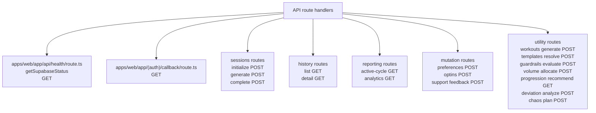
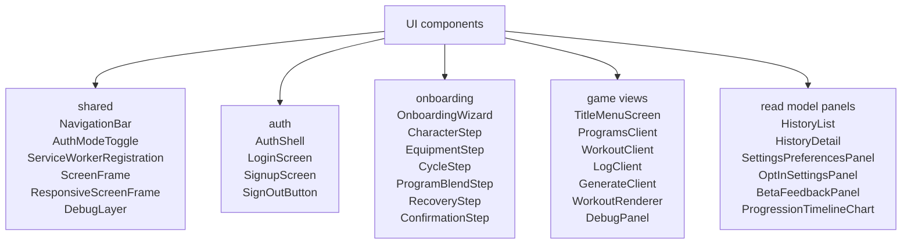

# Runtime Function Surface

This is a source-oriented inventory for the current app functions and service helpers. It focuses on runtime code under `apps/web`, plus the Rust engine functions that the web shell calls through `runEngineInput`.

## API Route Handlers

## Shared Libraries

```mermaid
flowchart TB
  Libs["apps/web/src/lib"]
  Libs --> EngineReplay["engine-replay.ts<br/>utf8KeyCompare<br/>canonicalizeNumber<br/>isRecord<br/>canonicalizeReplayValue<br/>serializeCanonicalReplayJson<br/>computeCanonicalReplayReferenceHash"]
  Libs --> Ids["ids.ts<br/>toLookupId<br/>toLookupIds<br/>toStringId"]
  Libs --> DbTransformers["db-transformers.ts<br/>getDefaultUserStats<br/>buildFatigueState<br/>normalizeStringList<br/>toExerciseData<br/>toMuscleMapping<br/>normalizeLockType<br/>toProgramSlot<br/>toProgramDay<br/>toTemplateSlot<br/>toTemplateDay<br/>toProgramTemplate"]
  Libs --> Env["env.ts<br/>readEnvValue<br/>serverEnv<br/>clientEnv"]
  Libs --> EngineRunner["engine-runner.ts<br/>resolveEngineManifestPath<br/>runEngineInput"]
  Libs --> RouteHandler["api/routeHandler.ts<br/>toIp<br/>finalizeResponse<br/>jsonResponse<br/>defaultValidationBody<br/>normalizeCookieOptions<br/>runAuthedRoute<br/>parseJsonWithSchema<br/>parseWithSchema"]
  Libs --> Supabase["supabase clients<br/>getBrowserClient<br/>getClient<br/>createSupabaseAdminClient<br/>createSupabaseServerComponentClient<br/>createSupabaseServerActionClient<br/>createSupabaseMiddlewareClient"]
  Libs --> Auth["auth helpers<br/>getAuthGuardRedirect<br/>getFirstSearchParamValue<br/>resolveSafeRedirectTo<br/>resolveSafeCallbackRedirect"]
  Libs --> Security["security<br/>rateLimit<br/>applySecurityHeaders"]
  Libs --> Observability["observability<br/>resolveRequestId<br/>attachRequestIdHeader<br/>logServerEvent"]
  Libs --> Start["start-screen.ts<br/>resolveStartScreen"]
```

## Module Services

```mermaid
flowchart TB
  Modules["apps/web/src/modules"]
  Modules --> AuthModule["auth<br/>signInAction<br/>signUpAction<br/>signOutAction<br/>logoutUserSession<br/>toAuthedUser"]
  Modules --> OnboardingModule["onboarding<br/>normalizeList<br/>fatiguePreferenceToLevel<br/>normalizeProgramWeights<br/>completeOnboarding"]
  Modules --> ProgramModule["programs<br/>readCanonicalClassArchetype<br/>readClassPresetId<br/>getAvailablePrograms<br/>normalizeSlotRow<br/>normalizeDayRow<br/>getProgramCatalog<br/>getUserActiveCycleView<br/>getUserActiveProgram<br/>getProgramById<br/>updateUserActiveProgram<br/>activateProgramAction"]
  Modules --> CycleModule["cycles<br/>parseCanonicalClassArchetype<br/>parseClassPresetId<br/>defaultNormalizedGamificationState<br/>toNormalizedGamificationState<br/>toProgramSelectionPayload<br/>normalizeStringList<br/>toExerciseReference<br/>resolveClassPreset<br/>findProgramTemplateIntegrityErrors<br/>buildProjection<br/>readInsertedId<br/>cleanupInitializedCycleState<br/>handleInitializeCycle<br/>shapeSelectedProgramsForPreset"]
  Modules --> SessionModule["sessions<br/>toNullableNumericId<br/>calculateSessionDurationSeconds<br/>calculateSessionVolume<br/>normalizeIdempotencyKey<br/>deriveCompletionIdempotencyKey<br/>normalizeOptionalSeed<br/>createSetLogInsertPayload<br/>redactReplayInputMaterial<br/>toReplayTraceInputMaterial<br/>parseEngineCompleteSessionOutput<br/>parseEnginePlanSessionOutput<br/>persistEngineSessionTrace<br/>rollbackEngineSessionTrace<br/>toCycleSlots<br/>derivePlanSessionFocus<br/>buildCycleBackedCompleteSessionEngineInput<br/>buildCycleBackedPlanSessionEngineInput<br/>syncNormalizedCycleCompletion<br/>persistCompletionTrace<br/>handleGenerateSession<br/>handleCompleteSession<br/>getRecentWorkoutHistory"]
  Modules --> ReportingModule["reporting<br/>derivePlanSessionReplayDebugBundle<br/>deriveWorkoutCompletionReplayDebugBundle<br/>derivePlanSessionExplanation<br/>deriveWorkoutCompletionExplanation<br/>getActiveCycleReporting<br/>getDeterministicAnalyticsReadModel<br/>getWorkoutCompletionReadModels<br/>detectStatsJsonCompatibilityDrift"]
  Modules --> HistoryModule["history<br/>getRelationName<br/>getMetadataString<br/>parseSetCountMap<br/>getWorkoutHistory<br/>getWorkoutDetail"]
  Modules --> DashboardModule["dashboard<br/>formatMuscleLabel<br/>formatExerciseLabel<br/>getFatigueSummary<br/>getRecentWorkoutSummary<br/>getDashboardRecentWorkouts<br/>getDashboardCycleSummary<br/>getProgressionTimelineSeries<br/>getWeeklyVolumeSummary"]
  Modules --> OtherServices["other services<br/>handleGenerateWorkout<br/>handleOptInUpdate<br/>handlePreferencesUpdate<br/>submitBetaFeedback<br/>handleResolveTemplate<br/>handleGuardrailEvaluate<br/>handleVolumeAllocate<br/>handleProgressionRecommend<br/>handleDeviationAnalyze<br/>handleChaosPlan"]
```

## UI Function Components

## Rust Engine Runtime Functions

```mermaid
flowchart TB
  Engine["packages/engine-rs/src"]
  Engine --> Public["lib.rs<br/>plan_session<br/>initialize_cycle<br/>complete_session"]
  Engine --> Boundary["boundary.rs<br/>parse_reference_snapshot<br/>parse_state_snapshot<br/>parse_policy_snapshot<br/>parse_input<br/>parse_output<br/>to_public_input<br/>to_public_output<br/>parse_result_value"]
  Engine --> Adaptation["adaptation<br/>plan_session<br/>initialize_cycle<br/>complete_session<br/>derived_input_hash<br/>derived_output_hash<br/>build_replay_receipt"]
  Engine --> Constraints["constraints.rs<br/>hard_block_records<br/>blocked_candidate_ids<br/>collapse_rejection_for_hard_blocks"]
  Engine --> Progression["progression.rs<br/>classify_trend<br/>branch_plan_action<br/>classify_completion<br/>action_from_completion<br/>progression_action_summary<br/>progression_state_patch"]
  Engine --> StateUpdate["state_update.rs<br/>build_completion_state_patch<br/>apply_engine_owned_state_patch"]
  Engine --> Derivations["derivations.rs<br/>clamp_f64<br/>round_f64<br/>normalize_slug<br/>value_as_f64<br/>value_as_i64<br/>value_as_str<br/>plan_progression_need<br/>fatigue_compatibility<br/>class_bias_score<br/>novelty_score<br/>recommended_session_id<br/>session_rationale<br/>progression_summary"]
  Engine --> Rng["rng.rs<br/>fnv1a64<br/>fnv1a64_hex<br/>sha256_hex<br/>derive_subseed<br/>seeded_fraction<br/>seeded_index<br/>seeded_order"]
  Engine --> Replay["replay.rs<br/>accepted_canonicalization_version<br/>canonical_policy_version<br/>quantize_f64<br/>number_from_scaled_f64<br/>validate_number_scale<br/>hash_value<br/>canonical_json_bytes"]
  Engine --> Logging["logging.rs<br/>decision_log_entry<br/>filter_log<br/>score_log<br/>tie_break_log<br/>classify_log<br/>award_xp_log<br/>replay_receipt<br/>semantic_state_patch<br/>empty_state_patch"]
  Engine --> Bins["bin<br/>engine_runner main/run/execute<br/>inspect_engine main/run/execute_fixture"]
```

