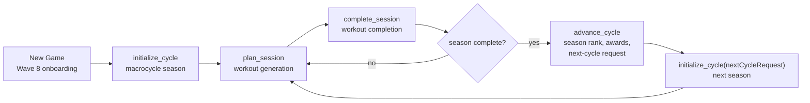
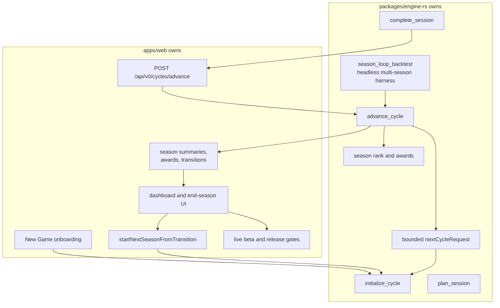
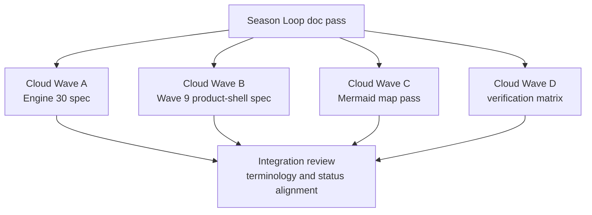
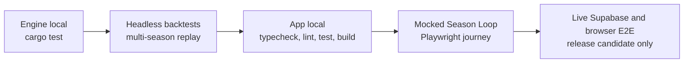

# Season Loop Roadmap

These diagrams show the current Season Loop runtime direction after Wave 8, Engine 30, and Wave 9, plus remaining release-only verification lanes.

## Product Loop

## Engine And App Split

## Parallel Documentation Waves

## Verification Ladder

